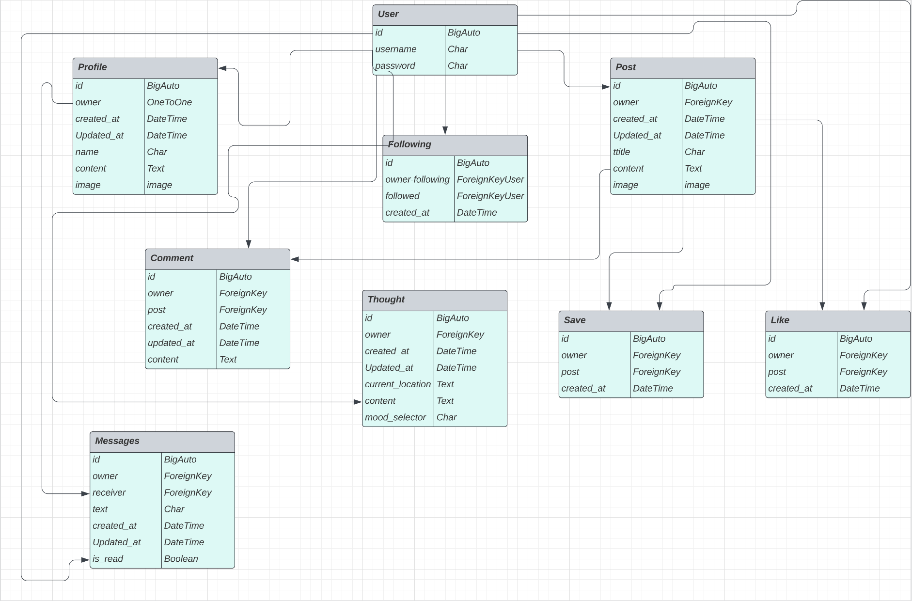

# Fshn API

Fashion is a social media platform created for all things fashion where designers, models, stylist and creatives can interact. They interact with each other via being able to post pictures to promote their brand, their style and fashion shows. They are also capable of sharing their thoughts on the current climate of fashion so that people can see their views on it and additionally save posts that inspire them. Fshn API has been created to back up and support all these demands from the users to be able to do these things. CRUD functionality was also implemented to allow the users to fully interact with the application.

#### DEPLOYED BACKEND API [LINK](https://fshn-api.herokuapp.com/)
#### DEPLOYED FRONTEND [LIVE SITE](https://fashion-react.herokuapp.com/)
#### DEPLOYED FRONTEND [REPOSITORY](https://github.com/AASanusi/fashion)

## Contents
- [Project Purpose](#Project-Purpose)
- [Planning](#Planning)
   - [Plan](#Plan)
   - [Demographics](#Demographics)
- [User Stories](#User-Stories)
- [Database](#Database)
- [Features](#Features)
   - [Existing Features](#Existing-Features)
      - [Profile](#Profile)
      - [Posts](#Posts)
      - [Comments](#Comments)
      - [Likes](#Likes)
      - [Followers](#Followers)
      - [Thoughts](#Thoughts)
      - [Saves](#Saves)
      - [Messages](#Messages)
   - [Features Left to Implement](#Features-Left-to-Implement)
- [Technologies Used](#Technologies-Used)
   - [Main Languages Used](#Main-Languages-Used)
   - [Frameworks, Libraries And Programs Used](#Frameworks-Libraries-And-Programs-Used)
- [Testing](#Testing)
   - [Manual Testing](#Manual-Testing)
   - [Validator Testing](#Validator-Testing)
   - [Unfixed Bugs](#Unfixed-Bugs)
- [Deployment](#Deployment)
- [Credits](#Credits)
   - [Content](#Content)
   - [Media](#Media)

## Project Purpose
- To design and build a content-sharing web application with React and an API (Django REST Framework) Back-End. 
- This is to allow users to browse and comment/like each others posts. Users will be able to follow each other as well as update and delete their own content too. 

## Planning
### Plan
- The plan for this project was to create custom models to help with the functionalities:
   - Thoughts: A wall where users can share their thoughts to either promote their brand, style or share their thoughts on fashion in 2023.
   - Saves: Bookmark feature for users to save posts they like and would like to view later.
   - Direct Messaging(dms): A form of communication between users of the application.
### Demographics
- For:
   - Developers who would like to build Front-end content-sharing web application
- Intended:
   - For users to interact with the application.
## User Stories
To help with viewing the users stories, click [Github Issues](https://github.com/AASanusi/fashion/issues) and [KANBAN board](https://github.com/users/AASanusi/projects/2).
### Epic 1: Navigation
1. As a user I can view user's avatars so that I can easily identify users of the application.
2. As a user I can view a navbar from every page so that I can navigate easily between pages.
3. As a logged out user I can see sign in and sign up options so that I can sign in/sign up.
4. As a user I can navigate through pages quickly so that I can view content seamlessly without page refresh.
### Epic 2: Authentications
5. As a user I can create a new account so that I can access all the features for signed up users.
6. As a user I can sign in to the app so that I can access functionality for logged in users.
7. As a user I can tell if I am logged in or not so that I can log in if needed.
8. As a user I can maintain my logged-in status until I choose to log out so that my user experience is not compromised.
### Epic 3: Posts
9. As a logged in user I can create posts so that I can share my images with the world!
10. As a user I can view the details of a single post so that I can learn more about it.
11. As a user I can view all the most recent posts, ordered by most recently created first so that I am up to date with the newest content.
12. As a user, I can search for posts with keywords, so that I can find the posts and user profiles I am most interested in.
13. As a user I can keep scrolling through the page and scrolls are automatically loaded with no pagination.
14. As a user I can view the posts page so that I can read the comments about the post.
15. As a post owner I can edit my post title and description so that I can make corrections or update my post after it was created.
16. As a logged in user I can add comments to a post so that I can share my thoughts about the post.
17. As a user I can see how long ago a comment was made so that I know which comments are new.
18. As a user I can read comments on posts so that I can read other users thoughts.
19. As an owner of a comment I can delete my comment so that I can remove comments I no longer want on a post.
20. As an owner of a comment I can edit my comment so that I can fix or update existing comments on posts.
21. As a logged in user I can like a post so that I can show appreciation for the post.
### Epic 4: Profiles
22. As a user I can view other users profiles so that I can see their posts and learn more about them.
23. As a user I can see a list of people to follow based on being the most followed profiles so that I can see which profiles are popular.
24. As a user I can view statistics about a specific user: bio, number of posts, follows and users followed so that I can learn more about them.
25. As a logged in user I can follow and unfollow other users so that I can follow profiles I like or unfollow users I no longer want to follow.
26. As a logged in user I can edit my profile so that I can change my profile picture and bio.
27. As a logged in user I can update my username and password so that I can change my display name and keep my profile secure.
### Epic 5: Saves
28. As a logged in user I can save a post so that I can bookmark the posts that interest me.
29. As a logged in user I can unsave a post I longer like.
30. As a logged in user I can view the posts I saved so that I can find the posts I enjoy the most.
### Epic 6: Messages
31. As a logged in user I can message other users so that I can chat with them.
32. As a logged in user I can view the message so that I can see what I said.
33. As a logged in user I can edit and delete my messages so that I can update and remove my messages.
### Epic 7: Thoughts
34. As a logged in user, I can share my thoughts and mood with everyone on the app.
35. As a logged in user, I can write my location and share it with everyone on the app.

## Database


## Features
### Existing Features
#### Profile
- Unregistered users can sign up to a create a profile
- Users can sign into their profile
- Users can see registered profiles
- Users can view lists of other Users
- Users can see the a detail view of other users
#### Posts
- Unregistered and registered users view all posts
- Once registered, Users can:
  - create posts
  - view their own posts
  - edit their own posts
  - delete their own posts
#### Comments
- Unregistered and registered users view all comments
- Once registered, Users can:
  - create comments
  - view their own comments
  - edit their own comments
  - delete their own comments
#### Likes
- Unregistered and registered users view likes count on posts
- Once registered, Users can:
  - like other users post
  - unlike other users post
#### Followers
- Unregistered and registered users view other users following and followers stats
- Once registered, Users can:
  - follow a user 
  - unfollow a user 
### Custom models created:
#### Thoughts
- Unregistered and registered users view all thoughts shared on thoughts wall
- Once registered, Users can:
  - create thoughts
  - view their own thoughts wall
  - edit their own thoughts
  - delete their own thoughts
#### Saves
- Unregistered and registered users view saves
- Once registered, Users can:
  - save other users post
  - unsave other users post
#### Messages
- Only registered users can view all messages from other users
- Once registered, Users can:
  - message user
  - view message
  - edit their own message
  - delete their own message

### Features Left to Implement
- Future implementation will involve adding a categories model for all saved posts.
- To implement sharing post to another user.
- Ability for users to block each other.

## Technologies Used
### Main Languages Used
- [Python](https://en.wikipedia.org/wiki/Python_(programming_language))
### Frameworks, Libraries And Programs Used
1. #### [Django REST framework](https://www.django-rest-framework.org/)
   - Used to create API project
2. #### [Django](https://www.djangoproject.com/)
   - Used to create API project
3. #### [Heroku](https://id.heroku.com/login)
   - Heroku was used to deploy the project.
4. #### [Cloudinary](https://cloudinary.com/)
   - Used to store images
5. #### [Pillow](https://python-pillow.org/)
   - Python Imaging libraries.
6. #### [PostgreSQL](https://www.postgresql.org/)
   - This was used for database.
7. #### [Git:](https://git-scm.com/)
   - Git was used in the Gitpod terminal to add, commit and push code to Github.
8. #### [Gitpod:](https://www.gitpod.io/)
   - Gitpod is the Integrated Developer Environment used to code this project.
9. #### [Github:](https://github.com/)
   - Github was used to hold and keep the pushed codes by Git and store projects.
10. #### [Gitpod Python Essentials Template:](https://github.com/Code-Institute-Org/python-essentials-template)
   - Gitpod Python Essentials Template was provided by code institute and it consisted of all the relevant tools needed for the successful running of the application.
11. #### [Lucid Chart](https://lucid.app/)
   - Used to create Database ERD.
12. #### [ElephantSQL](https://www.elephantsql.com/)
   - New database added to store data in production.

## Testing
### Manual Testing
- Manually confirmed that all the url address created works and opens with no error observed.
- Tested the CRUD functionality for: Dms, Thoughts, Saves, Comments, Likes, Profiles, Posts, Followers
   - Created: new items for each model
   - Read: all urls worked for each item
   - Edit: capable of editing all items with no issues, this doesn't apply for Saves, Likes, Followers
   - Delete: successfully deleted items with no issues
- All search and filters feature all worked with no issues.
- For deployed API, tests were done for urls and all loaded.  
### Validator Testing
#### CI Python Linter
- Below are a few examples of python files that went through [PEP8 validator](https://pep8ci.herokuapp.com/) with no issues. All python files had no errors.
- Message model through validator 

- Thoughts views through validator

- Saves serializers through validator

- Posts urls through validator


### Unfixed Bugs
- All bugs were fixed before submitting the project.

## Deployment
The following steps will provide information on how to deploy to Heroku successfully.
- Github repository and Gitpod workspace created prior.

### Step 1:
- Install Django, packages and supporting libraries via 'pip install' command in the Terminal"
```
django<4'
dj3-cloudinary-storage
Pillow
dj_database_url
djangorestframework
django-filter
dj-rest-auth
'dj-rest-auth[with_social]'
djangorestframework-simplejwt
dj_database_url psycopg2
gunicorn
django-cors-headers
```
- Create Django project via:
````
django-admin startproject project_name .
````
### Step 2:
#### New External Database
- Log into [ElephantSQL](https://www.elephantsql.com/) account
- On ElephantSQL dashboard, access the database instance name for the project
- Copy ElephantSQL database URL(will be pasted in Convig Vars in Heroku and added to env.py on Gitpod later)

### Step 3:
#### Heroku App
   - On Heroku, creat and open new App.
   - Open settings tab and click to "Reveal Config Vars":
      - Key: ALLOWED_HOST | Value: api-app-name.herokuapp.com
      - Key: CLOUDINARY_URL | Value: cloudinary://hidden
      - Key: DATABASE_URL | Value: postgres://hidden
      - Key: DISABLE_COLLECTSTATIC | Value: 1
      - Key: SECRET_KEY | Value: hidden
##### Below are added after ReactApp:
   - Key: CLIENT_ORIGIN | Value: https://react-app-name.herokuapp.com
   - Key: CLIENT_ORIGIN_DEV | Value: https://gitpod-browser-link.ws-eu92.gitpod.io

### Step 4:
#### Prepare env.py file
- Create env.py file on top lovel of directory. Import and add following:
````
import os

os.environ['CLOUDINARY_URL'] = 'cloudinary://hidden'
os.environ['DEV'] = '1'
os.environ['SECRET_KEY'] = 'hidden'
os.environ['DATABASE_URL'] = 'postgres://hidden'
````

### Step 5:
#### Prepare settings.py file
- Below was added to:
````
INSTALLED_APPS = [
    'django.contrib.admin',
    'django.contrib.auth',
    'django.contrib.contenttypes',
    'django.contrib.sessions',
    'django.contrib.messages',
    'cloudinary_storage',
    'django.contrib.staticfiles',
    'cloudinary',
    'rest_framework',
    'django_filters',
    'rest_framework.authtoken',
    'dj_rest_auth',
    'django.contrib.sites',
    'allauth',
    'allauth.account',
    'allauth.socialaccount',
    'dj_rest_auth.registration',
    'corsheaders',

Below added as it is created:

    'profiles',
    'posts',
    'comments',
    'likes',
    'followers',
    'saves',
    'dms',
    'thoughts'
]
````
- Add SITE_ID value place under INSTALLED APPS List:
````
SITE_ID = 1
````

- Import database
````
import dj_database_url
import re
import os
if os.path.exists('env.py')
    import env
````
- Under the imports, add Cloudinary variable:
````
CLOUDINARY_STORAGE = {
    'CLOUDINARY_URL': os.environ.ger('CLOUDINARY_URL')
}

MEDIA_URL = '/media/'
DEFAULT_FILE_STORAGE = 'cloudinary_storage.storage.MediaCloudinartStorage'
````

- Under BASE_DIR, add the following:
````
REST_FRAMEWORK = {
    'DEFAULT_AUTHENTICATION_CLASSES': [(
        'rest_framework.authentication.SessionAuthentication'
        if 'DEV' in os.environ
        else 'dj_rest_auth.jwt_auth.JWTCookieAuthentication'
    )],
    'DEFAULT_PAGINATION_CLASS':
        'rest_framework.pagination.PageNumberPagination',
    'PAGE_SIZE': 10,
    'DATETIME_FORMAT': '%d %b %Y',
}
if 'DEV' not in os.environ:
    REST_FRAMEWORK['DEFAULT_RENDERER_CLASSES'] = [
        'rest_framework.renderers.JSONRenderer',
    ]

REST_USE_JWT = True
JWT_AUTH_SECURE = True
JWT_AUTH_COOKIE = 'my-app-auth'
JWT_AUTH_REFRESH_COOKIE = 'my-refresh-token'
JWT_AUTH_SAMESITE = 'None'

REST_AUTH_SERIALIZERS = {
    'USER_DETAILS_SERIALIZER': 'fshn_api.serializers.CurrentUserSerializer'
}
````
- Add Database:
````
if 'DEV' in os.environ:
    DATABASES = {
         'default': {
             'ENGINE': 'django.db.backends.sqlite3',
             'NAME': BASE_DIR / 'db.sqlite3',
         }
     }
else:
    DATABASES = {
         'default': dj_database_url.parse(os.environ.get("DATABASE_URL"))
    }
````

- Update DEBUG and set to only available in development and not production:
````
DEBUG = 'DEV' in os.environ
````
- Heroku app added to ALLOWED_HOSTS variable:
````
ALLOWED_HOSTS = [
   os.environ.get('ALLOWED_HOST'),
   'localhost',
]
````
- Add updated version of CSRF_TRUSTED_ORIGINS 
````
['https://gitpod-browser-link.ws-eu92.gitpod.io']
````
- Using DRF_API walkthrough cheat sheet to add CORS_ALLOWED variable:
````
if 'CLIENT_ORIGIN' in os.environ:
    CORS_ALLOWED_ORIGINS = [
        os.environ.get('CLIENT_ORIGIN')
    ]

if 'CLIENT_ORIGIN_DEV' in os.environ:
    extracted_url = re.match(
        r'^.+-', os.environ.get('CLIENT_ORIGIN_DEV', ''), re.IGNORECASE
    ).group(0)
    CORS_ALLOWED_ORIGIN_REGEXES = [
        rf"{extracted_url}(eu|us)\d+\w\.gitpod\.io$",
    ]
````

- On MIDDLEWARE  list, added following:
````
'corsheaders.middleware.CorsMiddleware',
````
- Final preparation of environment:
   - Create Procfile on top level of directory and add the following:
   ````
   web: gunicorn project_name.wsgi
   ````
   - Migrate the database:
   ````
   python3 manage.py makemigrations
   python3 manage.py migrate
   ````
   
- In the Terminal:
   - Update the requirements file
   ````
   pip freeze > requirements.txt
   ````
   ````
   git add
   git commit 
   git push
   ````

#### Connect the project’s Github repo to Heroku
- In Heroku "Deploy" tab:
   - On the "Deploy" page, find "Deployment method" section, select "Github" and click the "Connect to Github" button
   - Search and click on Github repository project
   - In the Manual deploy section, choose the Master Branch, click Deploy branch
   - Alternatively, can deploy automatically 
   - Once complete, click open App to view deployed application


## Credits
### Media
- Default post image photo taken from Code Institue walkthrough video.
- Default profile image photo taken from Code Institue walkthrough video.
### Content
- [Code Institue](https://codeinstitute.net/) walkthrough video "DRF-API" aided to form step by step process to create the API database.
- [SteamIt](https://steemit.com/utopian-io/@ajmaln/part-1-creating-a-simple-chat-app-with-djangorestframework) was used to help create direct messaging model.
- Lauren-Nicole helped to refine my thoughts model.
- [Code Institue](https://codeinstitute.net/) walkthrough DRF cheat sheet used for deployment section.

